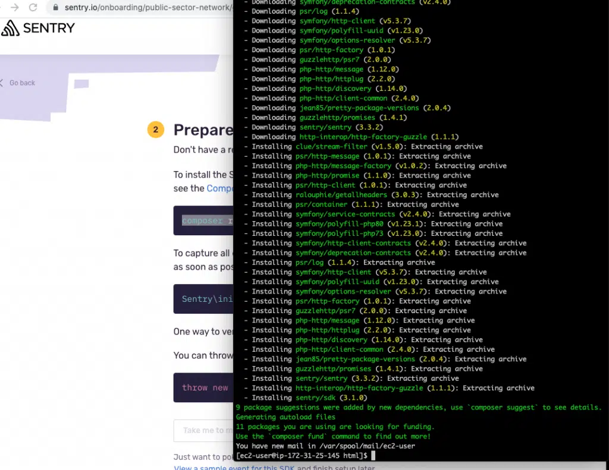
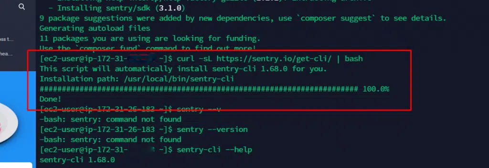
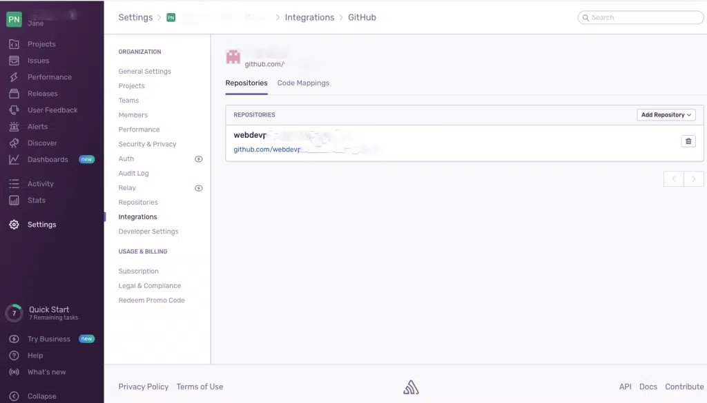

If you maintain a corporate wordpress site with a large database, you are going to need some help debugging it – in fact debugging your site can feel like a full time job without the right tools.

Fortunately companies have recognised this and Sentry does an excellent job of error reporting that is way beyond what you will get out of google console. You can choose from many languages including javascript, ruby, ASP, elixir and so on but for this example I am going to select PHP since WordPress is a PHP application.

Note: There is a Sentry wordpress plugin which does the same thing, but I had trouble using it with AWS so I have made the connection via SSH.

Step 1.
Before we do anything, you need you go into your AWS dashboard, Ec2 – Security groups – inbound rules and make sure your IP address is added in to SSH on port 22. I have blurred the IP addresses but as long as your Ip is added into your default group, ypou are good to go.

jane james wordpress developer inbound rules aws
Step 2.
Next go to EC2 – instances, select your instance and click “connect.” This will bring you to this screen here, where you will see details of how to connect to your Ec2. First, go into terminal and CD to the file where your .pem file is saved for your instance. Once you have done this you can run chmod 400 pemfilename.pem and connect to linux

Step 3.
Now we are connected to linux Amazon ec2, we are going to go to our root directory. For me I ran cd /var/www/html but you should go to the folder containing your HTML files.

Now we are going to run the below commands excluding the dollar signs.

#update ec2 files
$sudo yum update -y 
#Install git in your EC2 instance
$sudo yum install git -y 
#Check git version
$git version

Step 4.
To connect to your Github account run the following:

$ ssh-keygen -t rsa -b 4096 -C "your_email@example.com"

Your terminal will ask you to enter a file name to save the key and some pass phrases. Just hit enter to save the key to the default file, and continue without using a passphrase.

login to your SFTP client (I use transmit for Mac Os) and file the .ssh hidden folder. and open the file titled id_rsa.pub in text edit. Copy the entire string to your clipboard.

Go to https://github.com/settings/keys and make a new ssh key. You can give it whatever title you want. Paste the key you just copied from id_rsa.pub within the ‘key’ text field and click ‘add ssh key.’ You are now connected to Github and won’t have to sign in every time you want to push to your ec2 instance.

Next, return to your ec2 root directory and make a new directory to clone Github:

$ mkdir projects
$ cd projects
$ git clone git@github.com:my-github-repo

Step 5.
Next we need to install Sentry cli from our root directory in our instance. The docs for php are here. Once you install the Sentry cli, the symfony scripts will run and you will see them install in your terminal like this:

Step 6.
Now we need to check that Sentry CLI has installed in our instance. If you run sentry –version and you return a version number you know Sentry has been installed on your Ec2.

Step 7.
Ok remember how we made a directory called projects in our ec2 that is connected to Github? We are going to CD to that directory, which is currently empty and then clone our site files to that directory using transmit. In the below image, the file on the left is the github directory we created and the one on the right is the root folder of your wordpress directory. Select all files on the right and click upload

Step 8.
Once your files have uploaded (this may take a while) check your remote is setup to fetch and push but typing git remote -v in terminal, and if your branches are correct then don’t forget to do a git commit and send your files from ec2 to your repository.

Step 9.
Once you have finished you can see your Ec2 is connected to Sentry via Github and can now receive error tracking:

*Alpha Omega Digital is a WordPress web development agency based in Melbourne, Australia but also services clients from Sydney, Brisbane, Newcastle, Perth, Adelaide, Darwin and Hobart.*