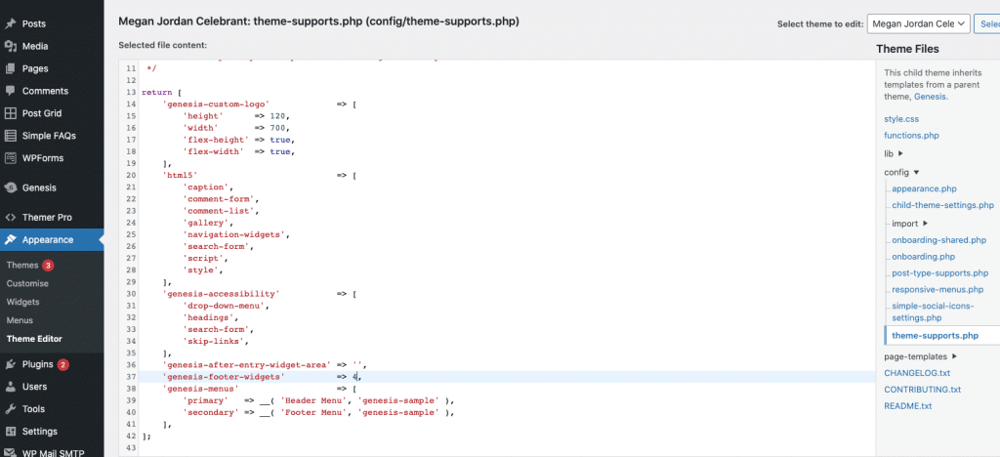
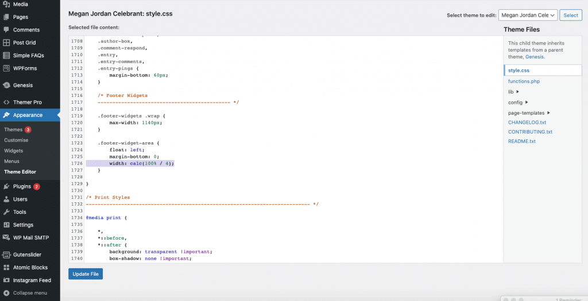
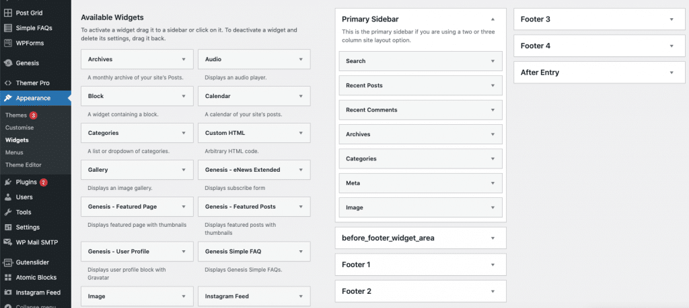
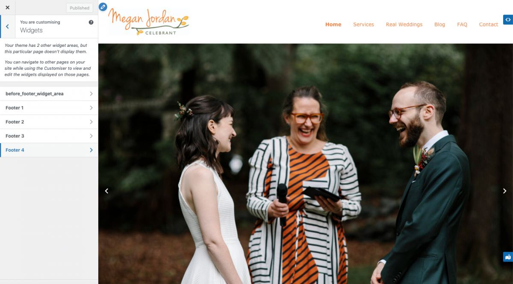

So I was working on some updates for a client Megan Jordan and she wanted a fourth footer widget area added to her site for an acknowledgement to country. I built her site using the Genesis sample SCSS theme by Cobalt apps which by default comes with 3 footer widget areas. To add a fourth you have to find the template where the number of widget areas are declared, and modify it.

HOW TO ADD A FOURTH FOOTER WIDGET TO GENESIS SAMPLE
In your admin dashboard go into appearance- theme editor – config – theme supports.php and scroll down to the rule for genesis-footer-widgets and change it from 3, to 4.

2. Go into your style.css sheet from the theme file directory, and edit the footer-widget-area section on line 1726. Change it from width: calc(100%/3) to width: calc(100%/4)

3. Now go into your appearance – widgets area, and you can see the 4th footer widget area is available in the widget options:

4. Now, go to the front end of your site and click on the customiser. Once you select widgets you can also see the 4th widget area here, and now you can add any element you want – text, html, image etc.

There are much more complex ways to achieve this, but overall something simple effective and repeatable is the way to go. It saves the client development time, and it saves you from building even more custom functions on your WordPress project.

*Alpha Omega Digital is a WordPress web development agency based in Melbourne, Australia but also services clients from Sydney, Brisbane, Newcastle, Perth, Adelaide, Darwin and Hobart.*

