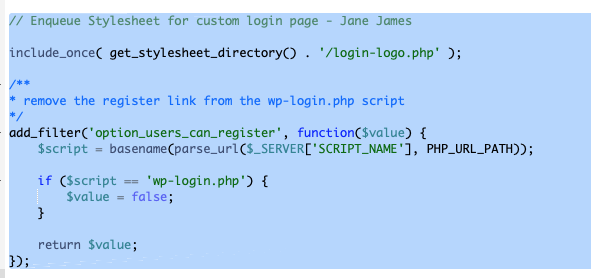
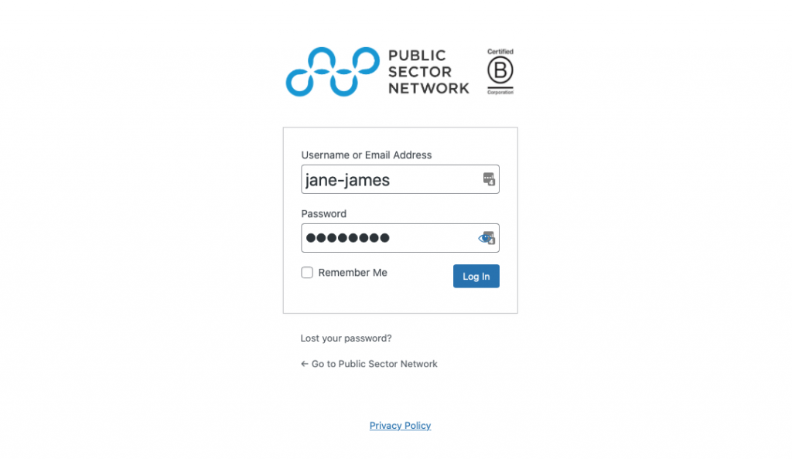

Hi all, I was working on a project where the clients site was using a plugin WP-user front end to handle logging in and out of the site. And you know, the plugin works totally fine but in this particular case, we are rebuilding all the plugins into templates to reduce the plugin dependencies, increase load time and reduce JS/CSS conflicts. 

So I came across this excellent tutorial from Bill Erickson on how to add a custom logo to the wordpress login template. I also added a couple of steps such as removing the registration button, as I want all registrants to sign up via Wp Forms which enables a white list and also sends data to Hubspot. The other step is just making the background white, which is added into the same template file. 

Let’s get started shall we?

The first step is going to the root directory of your current theme, and creating a new file called login-logo.php. 

Next copy and paste this code into your new template file, and make sure to change the author details to your own, and theme details to the one you are using:

Make sure you upload the logo to the correct file path which is /assets/images/your-filename.png, or any other file path you create under your assets folder. You should definitely play around eight he height and width attributes to suit your logo, and once you are happy you can save your template file. 

I also changed the template file to white. 

Next, open your functions.php file and enqueue the login template we just created. Additionally, I chose to de register the registration link, as I only want clients to register via [Wp forms](https://wpforms.com") which contains my whitelist and also sends data to [Hubspot](https://hubspot.com")

This is what my functions.php file looks like:

That is it, and now you can view your custom login page: 

Adding client logos to their login pages gives a nice custom login page that is personalised and on brand. You can add any styles or colours you want, just add the CSS into the login-logo.php file.

*Jane James is a WordPress web developer based in Melbourne, Australia but also services clients from Sydney, Brisbane, Newcastle, Perth, Adelaide, Darwin and Hobart.*